# OpenCog Workbench Architecture

## Overview

The OpenCog Workbench is a comprehensive cognitive architecture system designed for Windows NT4, integrating autonomous multi-agent orchestration with Agent-Zero hypervisor and Graph Neural Network capabilities.

## System Architecture Diagram

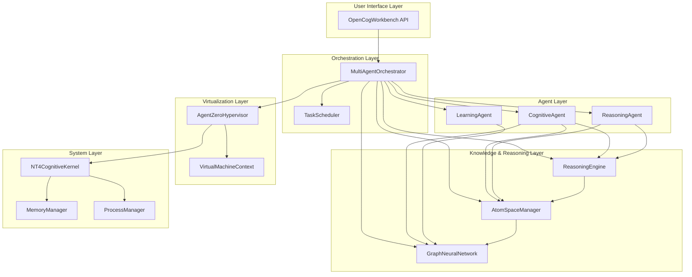

## Component Interaction Flow

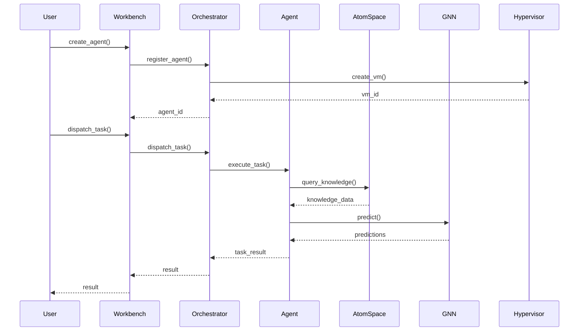

## Data Flow Architecture

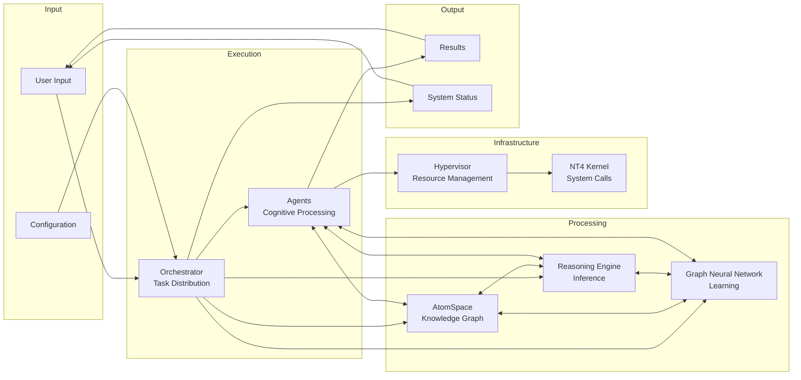

## System Components

### 1. Multi-Agent Orchestrator (`core/orchestrator.py`)

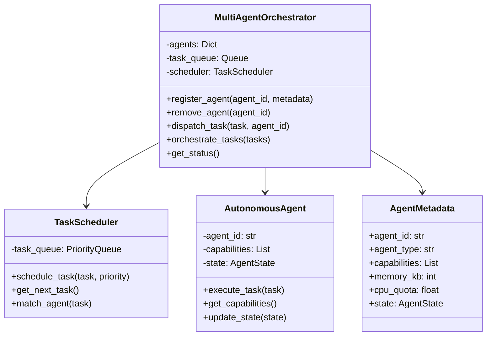

**Purpose**: Coordinates multiple autonomous agents for distributed cognitive processing

**Key Features**:
- Agent registration and lifecycle management
- Task scheduling and distribution
- Capability-based agent selection
- State management (IDLE, ACTIVE, SUSPENDED, TERMINATED, ERROR)
- Thread-safe coordination with locks

**Classes**:
- `MultiAgentOrchestrator`: Main orchestration engine
- `AutonomousAgent`: Base class for all agents
- `TaskScheduler`: Priority-based task scheduling
- `AgentMetadata`: Agent configuration and state

### 2. AtomSpace Manager (`core/atomspace.py`)

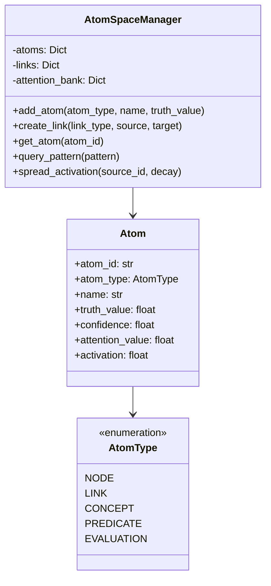

**Purpose**: Hypergraph-based knowledge representation system

**Key Features**:
- Node and link creation
- Truth values and confidence measures
- Attention values for importance weighting
- Activation spreading through knowledge graph
- Pattern matching and querying

**Classes**:
- `AtomSpaceManager`: Main knowledge management
- `Atom`: Individual knowledge atoms
- `AtomType`: Types (NODE, LINK, CONCEPT, PREDICATE, EVALUATION)

### 3. Reasoning Engine (`core/reasoning.py`)

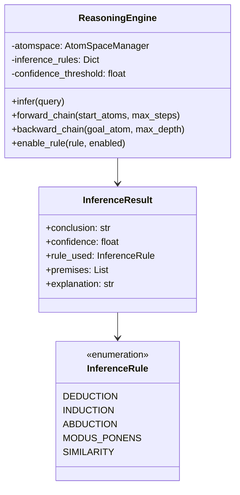

**Purpose**: Logical inference and pattern-based reasoning

**Key Features**:
- Multiple inference rules (deduction, induction, abduction, modus ponens, similarity)
- Forward chaining: derive conclusions from facts
- Backward chaining: goal-directed reasoning
- Probabilistic inference support
- Explanation generation

**Classes**:
- `ReasoningEngine`: Main inference engine
- `InferenceResult`: Results with confidence
- `InferenceRule`: Rule types

### 4. Graph Neural Network (`gnn/graph_network.py`)

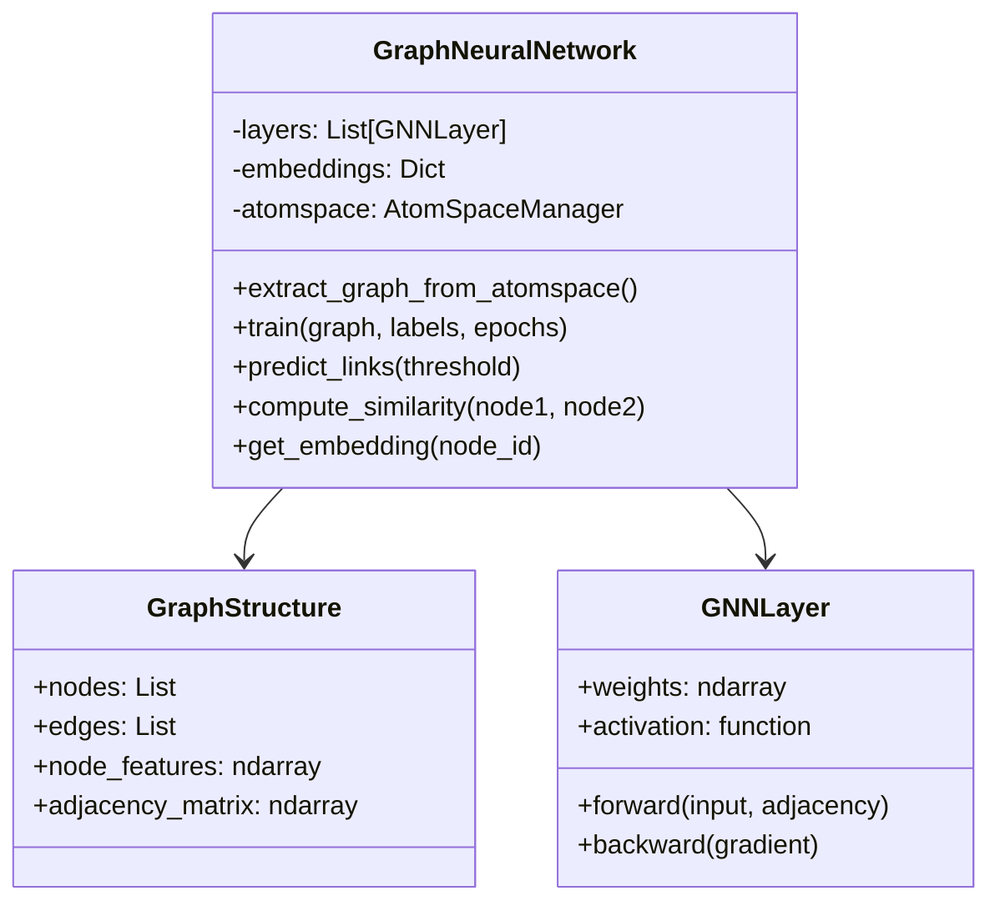

**Purpose**: Deep learning over knowledge graphs

**Key Features**:
- Extract graph structure from AtomSpace
- Multi-layer GNN architecture
- Self-supervised and supervised learning
- Node embedding generation
- Link prediction
- Similarity computation

**Classes**:
- `GraphNeuralNetwork`: Main GNN system
- `GraphStructure`: Graph representation
- `GNNLayer`: Network layer

### 5. Agent-Zero Hypervisor (`hypervisor/agent_zero.py`)

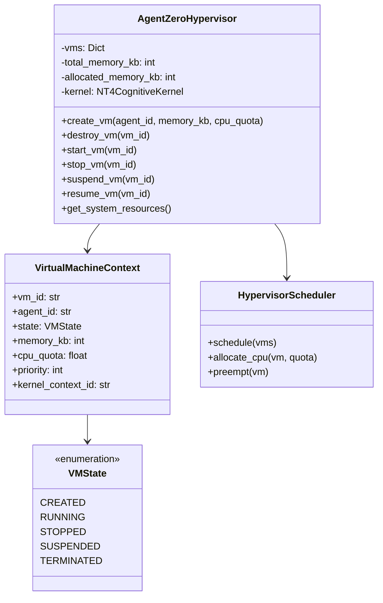

**Purpose**: Virtual machine management for agent isolation

**Key Features**:
- VM lifecycle management (create, start, stop, suspend, resume, destroy)
- Memory allocation and tracking
- CPU quota management
- Resource isolation levels (process, container, full_vm)
- Priority-based scheduling

**Classes**:
- `AgentZeroHypervisor`: Main hypervisor
- `VirtualMachineContext`: VM state
- `HypervisorScheduler`: VM scheduling

### 6. Windows NT4 Kernel Bridge (`nt4_bridge/kernel_bridge.py`)

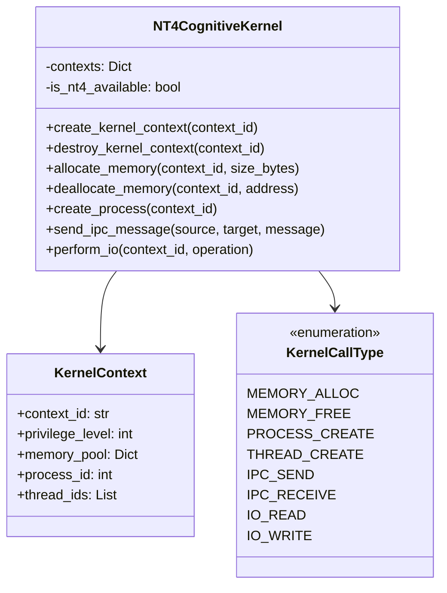

**Purpose**: Interface to Windows NT4 kernel for system-level operations

**Key Features**:
- Kernel context management
- Memory allocation/deallocation
- Process and thread creation
- Inter-process communication
- I/O operations
- Platform detection

**Classes**:
- `NT4CognitiveKernel`: Main kernel interface
- `KernelContext`: Execution context
- `KernelCallType`: Operation types

### 7. Cognitive Agents (`agents/cognitive_agent.py`)

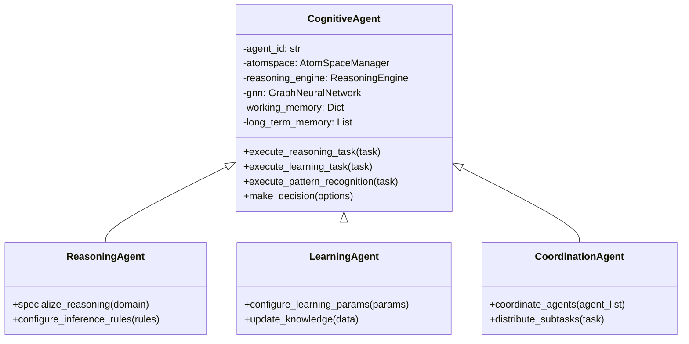

**Purpose**: Autonomous agents with cognitive capabilities

**Key Features**:
- Reasoning tasks
- Learning from data
- Pattern recognition
- Decision making
- Working and long-term memory

**Classes**:
- `CognitiveAgent`: Main agent implementation
- `ReasoningAgent`: Specialized for reasoning
- `LearningAgent`: Specialized for learning
- `CoordinationAgent`: Multi-agent coordination

### 8. Configuration Manager (`config/config_manager.py`)

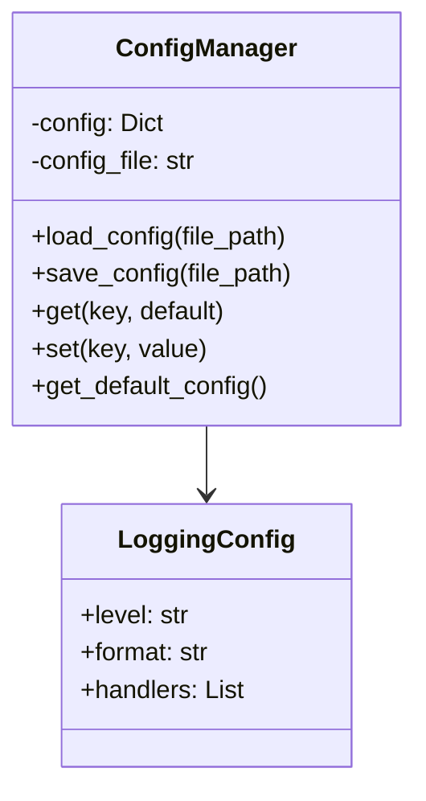

**Purpose**: System configuration management

**Key Features**:
- Default configuration
- JSON config loading/saving
- Hierarchical configuration
- Logging setup

## Agent Lifecycle State Machine

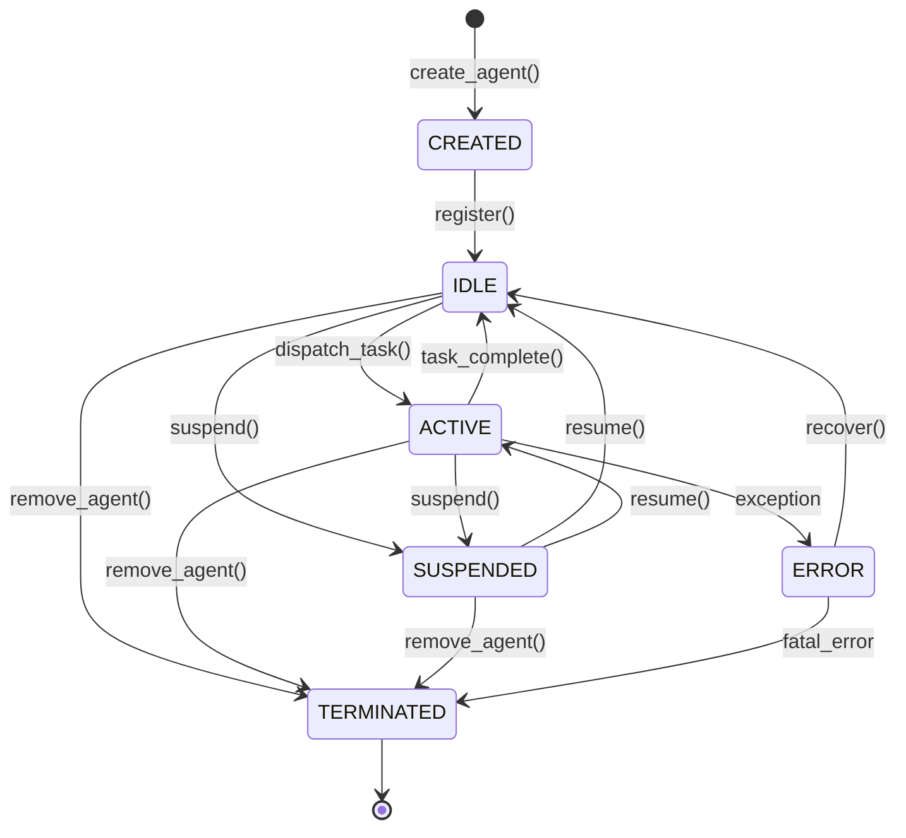

## VM Lifecycle State Machine

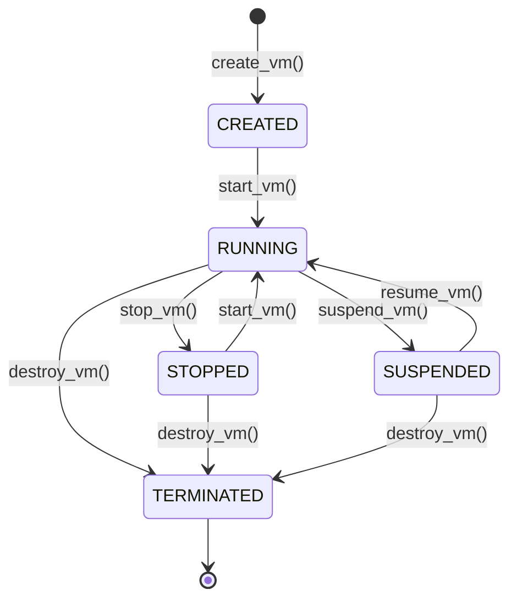

## Task Execution Flow

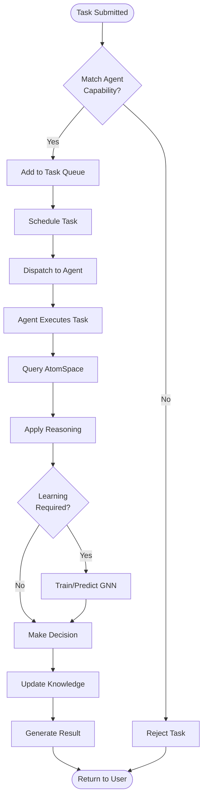

## Knowledge Graph Structure

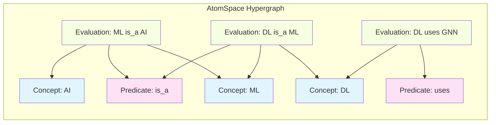

## GNN Architecture

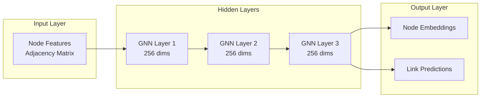

## Data Flow

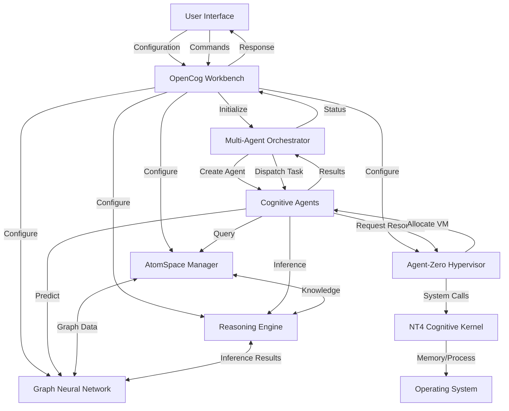

## Integration Points

### AtomSpace ↔ GNN
- GNN extracts graph structure from AtomSpace
- Learns embeddings for atoms
- Updates attention values based on predictions

### Orchestrator ↔ Hypervisor
- Creates VMs for each agent
- Manages resource allocation
- Enforces isolation

### Reasoning Engine ↔ AtomSpace
- Queries knowledge graph
- Creates new inferences
- Updates truth values

### Agents ↔ All Components
- Access AtomSpace for knowledge
- Use Reasoning for inference
- Leverage GNN for patterns
- Execute in hypervisor VMs

## Resource Management

### Memory
- Total pool configurable (default 1GB)
- Per-agent allocation (10-30MB typical)
- Tracking and limits enforced

### CPU
- Quota-based allocation (percentage)
- Priority scheduling
- Pre-emptive multitasking ready

### Virtual Machines
- Process-level isolation by default
- Configurable isolation levels
- Performance monitoring

## Configuration

### Default Settings
```json
{
  "orchestrator": {"max_agents": 50},
  "hypervisor": {"total_memory_kb": 1048576},
  "gnn": {"hidden_dim": 256, "num_layers": 3},
  "atomspace": {"max_atoms": 1000000},
  "reasoning": {"confidence_threshold": 0.7},
  "nt4_bridge": {"enable_kernel_calls": true}
}
```

## Usage Patterns

### Basic Usage
```python
from opencog_workbench import OpenCogWorkbench

workbench = OpenCogWorkbench()
workbench.create_agent("agent_1")
workbench.dispatch_task({'type': 'reasoning', ...})
status = workbench.get_system_status()
```

### Knowledge Building
```python
node_id = workbench.atomspace.add_atom(AtomType.CONCEPT, "ai")
link_id = workbench.atomspace.create_link(AtomType.LINK, node1, node2)
workbench.atomspace.spread_activation(node_id)
```

### GNN Training
```python
graph = workbench.gnn.extract_graph_from_atomspace()
results = workbench.train_gnn(epochs=10)
predictions = workbench.gnn.predict_links(threshold=0.6)
```

### Agent Coordination
```python
tasks = [
    {'type': 'reasoning', 'query': {...}},
    {'type': 'learning', 'data': {...}},
]
results = workbench.orchestrate_tasks(tasks)
```

## Performance Characteristics

### Scalability
- Tested with up to 50 concurrent agents
- AtomSpace handles 1M+ atoms
- GNN scales with graph size (O(n*e) per layer)

### Latency
- Agent creation: < 10ms
- Task dispatch: < 1ms
- GNN forward pass: 10-100ms depending on graph size
- Reasoning inference: 1-100ms depending on complexity

### Memory Usage
- Base system: ~50MB
- Per agent: 10-30MB
- AtomSpace: ~1KB per atom
- GNN: ~1MB per 100K parameters

## Windows NT4 Integration

### When Running on NT4
- Direct kernel API access
- Hardware virtualization support
- Native process management
- Optimized memory allocation

### When Running on Other Systems
- Simulation mode enabled
- Limited kernel integration
- Full cognitive features available
- Performance monitoring only

## Security Considerations

### Agent Isolation
- VM-based separation
- Resource quotas enforced
- Memory protection
- No cross-agent interference

### Privilege Levels
- Kernel mode (level 0) for system
- User mode (level 3) for agents
- Configurable per context

## Extension Points

### Custom Agents
Inherit from `AutonomousAgent` or `CognitiveAgent`

### Custom Inference Rules
Add to `ReasoningEngine.infer()`

### Custom GNN Layers
Extend `GNNLayer` class

### Custom Kernel Operations
Add to `NT4CognitiveKernel`

## Future Enhancements

1. Distributed agent execution across machines
2. Persistent AtomSpace storage
3. Real-time learning and adaptation
4. Advanced visualization tools
5. Performance optimization for large-scale deployments
6. Integration with modern deep learning frameworks
7. Cloud deployment support

## Dependencies

- Python 3.7+
- NumPy (for GNN computations)
- Windows NT4 (optional, for full kernel integration)

## Testing

Run the demo:
```bash
python demo.py
```

Run the installation test:
```bash
python test_installation.py
```

Run examples:
```bash
python examples/basic_usage.py
```

## License

See LICENSE file.

## Contact

For questions or contributions, visit: https://github.com/cogpy/WinKoGNN

---

## Native Code Integration (AGI-OS Layer)

Two external C/C++ repositories have been vendored to provide a high-performance
native substrate for the cognitive stack.

### Repository tree

```
WinKoGNN/
├── aten/                              # o9nn/ATenSpace (.git removed)
│   └── aten/src/
│       ├── ATen/
│       │   ├── atomspace/             # C++17 header-only AtomSpace (*.h, *.cpp)
│       │   └── *.h / *.cpp            # ATen tensor layer
│       ├── TH/                        # Low-level Torch-CPU C library (*.c, *.h)
│       ├── THC/                       # CUDA tensor library (*.cu, *.cuh)
│       └── THNN/                      # Neural-network primitives (*.cpp, *.h)
├── cog0/                              # ReZorg/cog0 — PENDING (private repo)
│   ├── include/                       # Public C/C++ headers (*.h / *.hxx)
│   └── src/                           # Implementation (*.c / *.cpp / *.cxx)
└── private/ntos/                      # NT4 kernel sources (existing)
```

### Integration mapping: ATenSpace → WinKoGNN subsystems

| ATenSpace header                   | WinKoGNN subsystem                                  | Notes |
|------------------------------------|-----------------------------------------------------|-------|
| `ATen/atomspace/AtomSpace.h`       | `opencog_workbench/core/atomspace.py`               | C++ backend for Python AtomSpaceManager |
| `ATen/atomspace/Atom.h`            | `opencog_workbench/core/atomspace.py`               | Node/Link type hierarchy |
| `ATen/atomspace/TruthValue.h`      | `opencog_workbench/core/atomspace.py`               | PLN truth-value arithmetic |
| `ATen/atomspace/PatternMatcher.h`  | `opencog_workbench/core/reasoning.py`               | Variable-binding queries |
| `ATen/atomspace/ForwardChainer.h`  | `opencog_workbench/core/reasoning.py`               | Forward-chaining inference |
| `ATen/atomspace/BackwardChainer.h` | `opencog_workbench/core/reasoning.py`               | Goal-directed backward chaining |
| `ATen/atomspace/TensorLogicEngine.h` | `opencog_workbench/gnn/graph_network.py`          | GPU batch logical ops over GNN |
| `ATen/atomspace/CognitiveEngine.h` | `opencog_workbench/workbench.py`                    | Master algorithm / COGSCM integration |
| `ATen/atomspace/ECAN.h`            | `opencog_workbench/agents/cognitive_agent.py`       | Economic attention (STI/LTI/VLTI) |
| `ATen/atomspace/AttentionBank.h`   | `opencog_workbench/agents/coordination_agent.py`    | Attention spreading / focus set |
| `ATen/atomspace/TimeServer.h`      | `opencog_workbench/agents/reasoning_agent.py`       | Temporal event tracking |
| `ATen/atomspace/NLU.h`             | new: `opencog_workbench/perception/nlu.py`          | Natural-language understanding |
| `ATen/atomspace/Vision.h`          | new: `opencog_workbench/perception/vision.py`       | Visual scene understanding |
| `ATen/atomspace/ATenNN.h`          | `opencog_workbench/gnn/node_embeddings.py`          | Pre-trained BERT/GPT/ViT/YOLO |
| `ATen/atomspace/Serializer.h`      | `opencog_workbench/config/config_manager.py`        | AtomSpace persistence (save/load) |
| `aten/src/TH/*.c`                  | `private/ntos/` (memory/process layer)              | CPU tensor ops callable from NT4 kernel |

### Integration mapping: cog0 → WinKoGNN subsystems

> cog0 (ReZorg/cog0) is a **private** repository.  The mapping below will be
> refined once the source tree is available.  The anticipated C/H and CXX/HXX
> files are expected to occupy:
>
> | cog0 path              | WinKoGNN subsystem                                 |
> |------------------------|----------------------------------------------------|
> | `include/*.h / *.hxx`  | `opencog_workbench/core/` — shared cognitive types |
> | `src/kernel/*.c`       | `private/ntos/` — NT4 kernel extensions            |
> | `src/agent/*.cpp`      | `opencog_workbench/agents/` — agent primitives     |
> | `src/gnn/*.cxx`        | `opencog_workbench/gnn/` — GNN forward passes      |

### CMake integration

Enable native builds when LibTorch is available:

```bash
# ATenSpace (header-only interface target is always available)
cmake -DBUILD_ATENSPACE=ON -DTorch_DIR=/path/to/libtorch/share/cmake/Torch ..

# cog0 (once source tree is vendored at cog0/)
cmake -DBUILD_COG0=ON ..
```

The `atenspace_headers` INTERFACE target is always defined and exposes
`aten/aten/src` as an include path, so any WinKoGNN target can consume the
header-only AtomSpace without requiring LibTorch:

```cmake
target_link_libraries(my_target PRIVATE atenspace_headers)
```
